<div align="center">
  
</div>

<p align="center">
  
</p>

<h3 align="center">
  🌐 <b>Live Demo:</b> <a href="https://dvs-it-ticket-res.streamlit.app/">https://dvs-it-ticket-res.streamlit.app/</a>
</h3>

## 📖 Project Status

- **Version**: 1.0.0
- **Production Ready**: Yes
- **Test Suite**: Passed (API & Endpoints)
- **Architecture**: Client-Server (FastAPI + Streamlit)
- **AI Engine**: Groq Llama 3.1 8B (Resolution Generation)
- **NLP Matching**: Scikit-Learn (TF-IDF Cosine Similarity)

---

## 📖 Project Overview

IT Ticket Resolution is an AI-powered, highly-deterministic technical support engine designed to ensure that enterprise IT issues are instantly resolved by cross-referencing incoming requests against a verified historical knowledge base.

Unlike generic LLM chatbots, this engine operates as a **RAG Comparison Engine**. It maps the semantic context of a new IT ticket (hardware, software, network, access) to the most mathematically similar historical ticket (using TF-IDF), and only then delegates the final resolution synthesis to a large language model (LLaMA 3).

---

## 🎯 Problem Statement

Manual IT support is slow, subjective, and prone to repetitive bottlenecks. Level-1 support engineers suffer from immense cognitive load answering the same password reset and hardware failure tickets repeatedly. Simple Generative AI solutions suffer from hallucinations and lack context of internal company policies. The IT Ticket Resolution system solves this by strictly enforcing mathematically grounded comparisons to *actual past company tickets* before generating a resolution.

---

## 🚀 Pipeline

<div align="center">
  
</div>

The deterministic resolution pipeline orchestrates an immutable sequence:
1. **Ticket Ingestion**: Parses incoming ticket title, description, and category.
2. **Vectorization**: Transforms the text into a TF-IDF vector representation.
3. **Similarity Search**: Calculates cosine similarity against the SQLite Historical Database.
4. **Context Injection**: Retrieves the highest-confidence matching historical resolution.
5. **LLM Synthesis**: Groq LLaMA 3.1 8B generates a tailored, step-by-step resolution grounded purely in the historical context.
6. **Canonical Reporting**: Outputs standard CSVs and visual Plotly analytics.

---

## 💻 Tech Stack

<div align="center">
  
</div>

- **Backend Framework**: Python 3.10+, FastAPI
- **Frontend Framework**: Streamlit
- **Embeddings / NLP**: `scikit-learn` (TF-IDF)
- **LLM API**: Groq (Llama 3.1 8B)
- **Database**: SQLite (SQLAlchemy ORM)
- **Authentication**: PyJWT, bcrypt

---

## 📂 Folder Structure

```text
IT-Ticket-Resolution/
├── backend/                              # Core API and AI engines
│   ├── app/
│   │   ├── main.py                       # FastAPI entrypoint
│   │   ├── database.py                   # SQLite config
│   │   ├── auth.py                       # JWT security
│   │   ├── llm_engine.py                 # Groq LLaMA integration
│   │   └── nlp_engine.py                 # TF-IDF matching
│   ├── seed_db.py                        # Historical data seeder
│   └── requirements.txt                  # Backend dependencies
├── frontend/                             # Streamlit user interface
│   ├── app.py                            # UI entrypoint
│   ├── config.py                         # UI configuration
│   ├── pages/                            # Auth, Dashboard, Tickets
│   ├── utils/                            # API client and UI components
│   └── requirements.txt                  # Frontend dependencies
├── assets/                               # Animated SVGs & visual assets
├── database.py                           # Legacy config
├── schema.sql                            # DDL schema
└── README.md                             # This file
```

---

## 🛠 Installation

### Prerequisites
- Python 3.10+
- Groq API Key

### Local Setup
```bash
# Clone the repository
git clone https://github.com/Darshanvs0730/IT-Ticket-Resolution.git
cd IT-Ticket-Resolution

# Set up Backend
cd backend
python -m venv .venv
source .venv/bin/activate
pip install -r requirements.txt
cp .env.example .env
# Add your GROQ_API_KEY to backend/.env
```

---

## 🚀 Running Production

You can boot the full stack locally.

**Run the Backend API:**
```bash
cd backend
python -m uvicorn app.main:app --reload --port 8000
```

**Run the Frontend Dashboard:**
```bash
cd frontend
python -m streamlit run app.py
```
